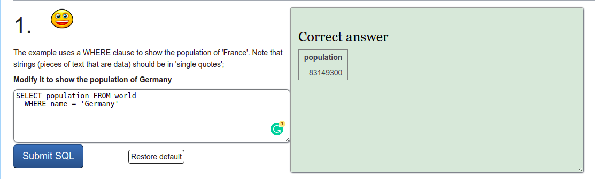

# SQLZoo

> This project demonstrates my domain knowledge of SQL by writing queries to retrieve and organize different pieces of data from a tables on [SQLZoo](https://sqlzoo.net/wiki/SELECT_basics).

Summary of queries run on the SQLZoo tutorial questions include the following:

1. SELECT basics
2. SELECT names
3. SELECT from WORLD Tutorial
4. SELECT from Nobel Tutorial
5. SELECT within SELECT Tutorial
6. SUM and COUNT
7. JOIN and UEFA EURO 2012
8. More JOIN operations
9. Using Null
10. NUMBERIC EXAMPLES
11. Window functions
12. Self join

## Getting Started

To get a local copy up and running follow these simple example steps.

1. Open terminal or command line
2. Run the following commands
 - $ `git clone https://github.com/francisuloko/SQLZoo.ggit`
3. Open sqlzoo-tutorial.sql file

## Built With

- SQL

### Prerequisites
1. Terminal or command line
2. Internet

## Authors

👤 **Author1**

- GitHub: [@FrancisUloko](https://github.com/francisuloko)
- Twitter: [@FrancisUloko](https://twitter.com/FrancisUloko)
- LinkedIn: [Francis Uloko](https://linkedin.com/in/francisuloko)

## 🤝 Contributing

Contributions, issues, and feature requests are welcome!

Feel free to check the [issues page](https://github.com/francisuloko/SQLZoo/issues).

## Show your support

Give a ⭐️ if you like this project!

## Acknowledgments

- Microverse Inc.
- The Odin Project

## 📝 License

This project is [MIT](https://mit-license.org) licensed.
